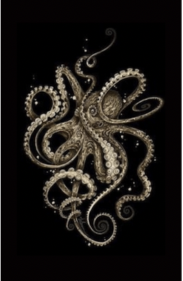

# ml-hwl-Witengier-Elizabeth

# My First Coding Assignment

## About Me ##
I am currently an 8th grade English teacher at a college preparatory school and looking forward to retiring from education in June. Prior to teaching, I worked in advertising and event planning following my graduation from UF in 1999. I also had a home organization business for many years when I started teaching. Although I am very familiar with learning management systems (LMS) and Adobe products, web development and coding are new to me. Although I am hyper-organized, I also have a creative side and enjoy painting, photography, and visual arts. I'm constantly juggling a million projects or ideas in my head, yet I am fluid and adaptable; therefore, an octopus best represents me.

## Past Coding Experience ##
I vaguely remember using HTML coding in the mid-90s for a UF English class one summer when we were learning about the "worldwide web." It was so advanced at the time, and classroom visitors cam in and out to see what a website looks like and how to click on links. I remember telling my parents and friends that everything was about to change from shopping, communicating, traveling, etc. Fast forward to right now, I feel like an English-speaking student who was just dropped off in Japan trying to catch up with the coding terminology—a very novice learner.

## Career Goals ##
I am confident that I will quickly catch on and learn this new "language." I would like to transition from education to do the following:

    1. Work Remotely (this is a primary goal).
    2. Work in web design with a focus on UX.

​​
# My First Coding Assignment

## About Me ##
I am currently an 8th grade English teacher at a college preparatory school and looking forward to retiring from education in June. Prior to teaching, I worked in advertising and event planning following my graduation from UF in 1999. I also had a home organization business for many years when I started teaching. Although I am very familiar with learning management systems (LMS) and Adobe products, web development and coding are new to me. Although I am hyper-organized, I also have a creative side and enjoy painting, photography, and visual arts. I'm constantly juggling a million projects or ideas in my head, yet I am fluid and adaptable; therefore, an octopus best represents me.

## Past Coding Experience ##
I vaguely remember using HTML coding in the mid-90s for a UF English class one summer when we were learning about the "worldwide web." It was so advanced at the time, and classroom visitors cam in and out to see what a website looks like and how to click on links. I remember telling my parents and friends that everything was about to change from shopping, communicating, traveling, etc. Fast forward to right now, I feel like an English-speaking student who was just dropped off in Japan trying to catch up with the coding terminology—a very novice learner.

## Career Goals ##
I am confident that I will quickly catch on and learn this new "language." I would like to transition from education to do the following:

    1. Work Remotely (this is a primary goal).
    2. Work in web design with a focus on UX.

